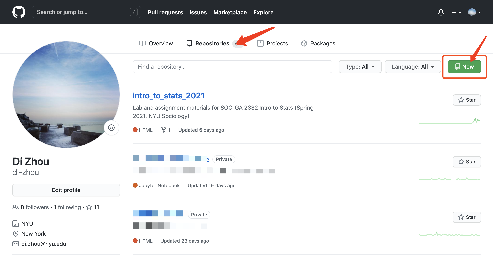
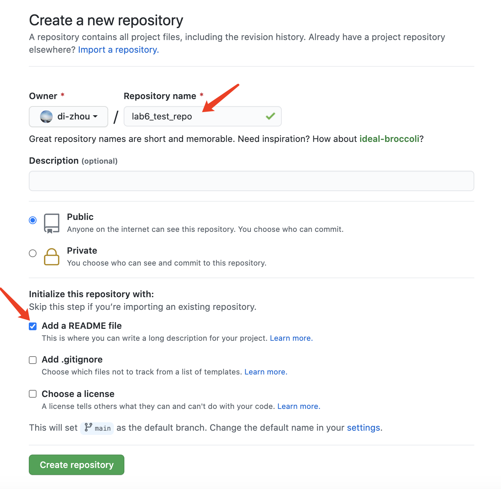
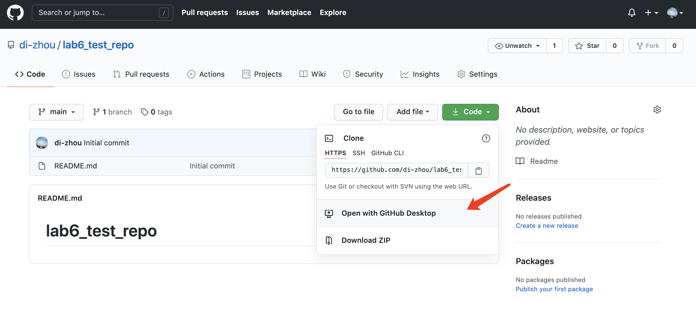
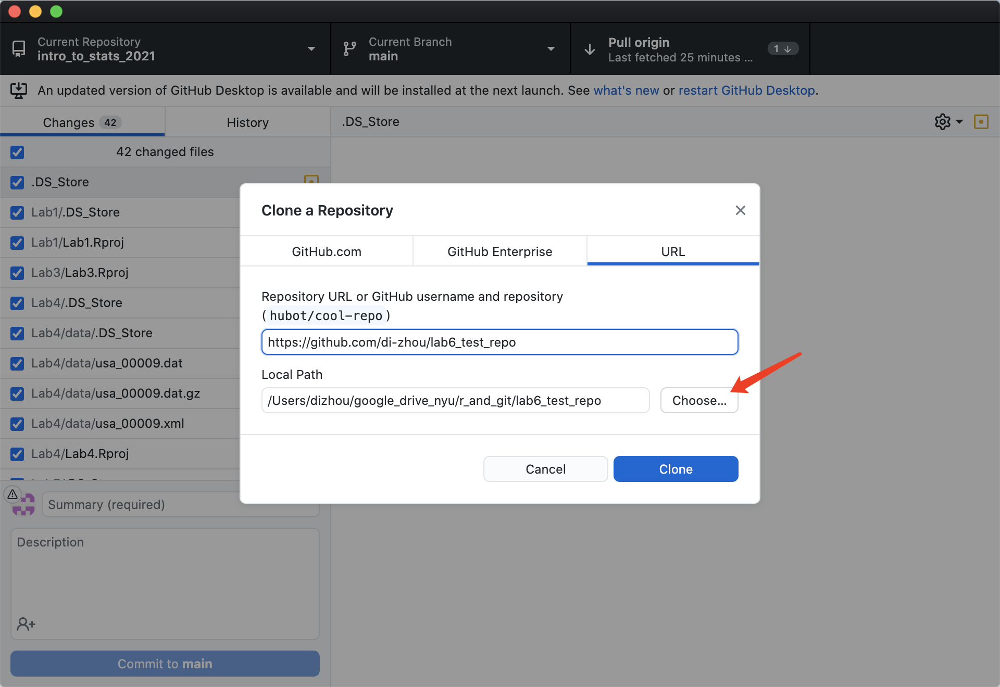
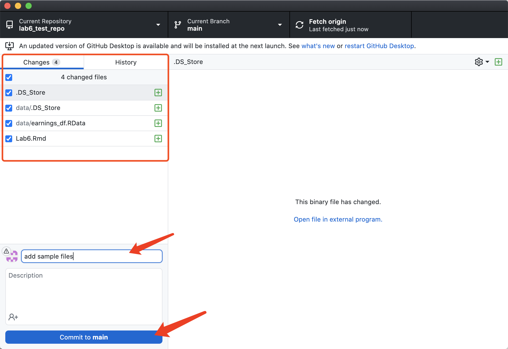
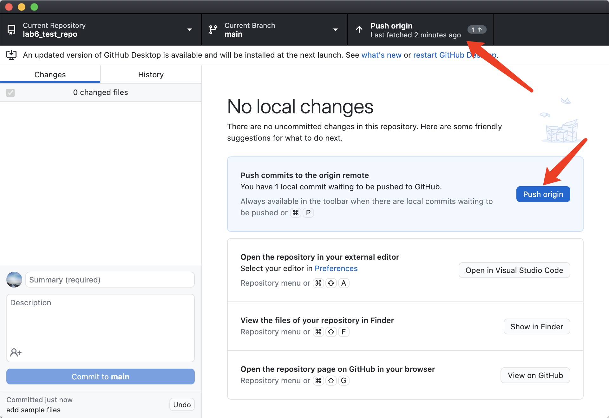
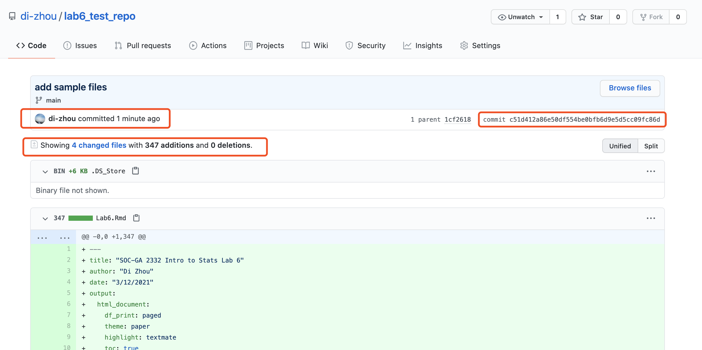
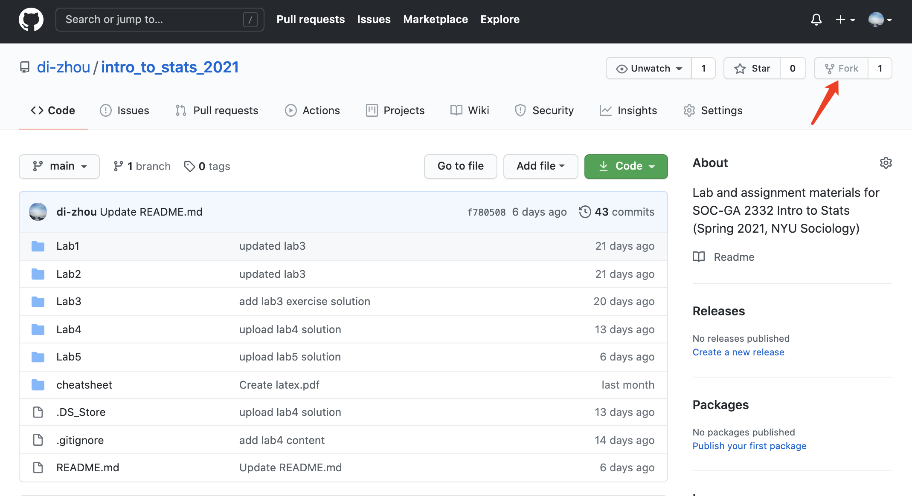
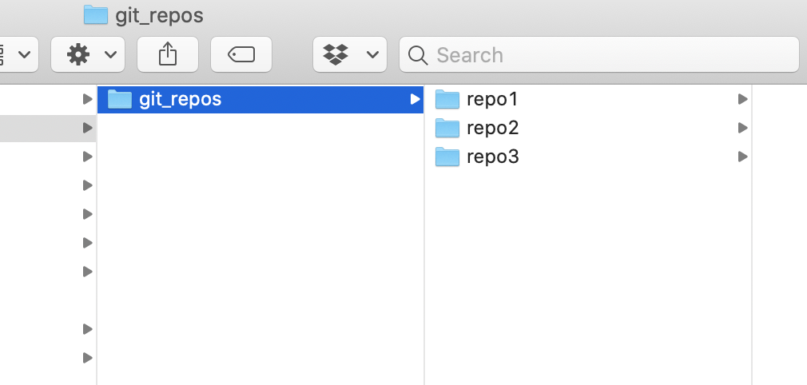

<style type="text/css">

body{ 

    font-size: 16px;
    line-height: 1.7em;
    <!-- text-align: justify; -->

}

blockquote {
    padding: 10px 20px;
    margin: 0 0 20px;
    font-size: 16px;
    border: solid 1px;
}

h1 { font-size: 32px; }

h2 { font-size: 24px; }

h3 { font-size: 20px; }

</style>

<br>

---

## Logistics & Announcement

- **Problem Set 2** is due on Sat. Mar. 20th, 11:59 pm. (NYU Classes: Resources > Assignments > ps2). You can use the .Rmd file I uploaded and put your answers in that file. Make sure you save all the necessary image files in your ps2 folder in order to knit.  
- Questions about ps2?
- **Problem Set 1** is returned. Questions or feedback?
- **Lab on Mar. 19th** & No Lab on Apr. 23rd
- **No office hour on Friday, Mar. 19th from 2:30-3:30 pm** due to schedule conflict. Please email me for appointments.

---

## Part 1: Q3 on Exam 2

3. (Bonus 3pts) Consider the prediction equation:
$$\hat Y = a + bX$$
where $a$ and $b$ are the intercept and slope coefficients respectively.

Suppose we construct two new variables $Y^*$ and $X^*$:  
  
  $$Y^* = 10 \cdot Y + 2$$
  $$X^* = 0.1 \cdot X$$
  
  Suppose our sample data remain the same, but we now regress $Y^∗$ on $X^∗$ and obtain the following prediction equation:
  $$\hat Y^* = a^* + b^*X$$
  
  How will the new intercept ($a^∗$) and slope ($b^∗$) relate to the original $a$ and $b$? (i.e., I’m asking you to express $a^∗$ and $b^∗$ as functions of $a$ and $b$.)  
  
  
#### Method 1: Express $X$ and $Y$ using $X^*$ and $Y^*$:
  
  Based on the question, we can express $X$ and $Y$ using $X^*$ and $Y^*$ by transforming the $X^*$ and $Y^*$ expressions to:

  $$Y = \frac{Y^* -2}{10} $$
  $$X = 10\cdot X^*$$
  Then $Y = a + bX$ becomes:
  
  $$\frac{Y^* -2}{10} = a + b\cdot 10\cdot X^*$$
 Arrange this to the form of $\hat Y^* = a^* + b^*X^*$:  
 
 $$Y^* -2 = 10 \cdot (a + b\cdot 10\cdot X^*)$$
 $$Y^* = 10 \cdot (a + b\cdot 10\cdot X^*) + 2$$
 $$Y^* = 10a + 100b\cdot X^* + 2$$
  Now, gather the intercept part of the above equation, which are terms whose value is not dependent on $X$, which include $10a$ and $+2$. Then, gather the slope part, which are terms whose value is dependent on $X^*$, which is $100b\cdot X^*$: 
 
 $$Y^* = (10a + 2) + 100 b\cdot X^*$$
  The above equation is $\hat Y^* = a^* + b^*X$, and the $a^*$ part is $(10a + 2)$, the $b^*$ part is $100b$.   
  
#### Method 2: Express $X^*$ and $Y^*$ using $X$ and $Y$, then you get expressions of $a$ and $b$ using $a^*$ and $b^*$:

First, start with the equation $\hat Y^* = a^* + b^*X$. Given that $Y^* = 10Y + 2$ and $X^* = 0.1X$, we can write $\hat Y^* = a^* + b^*X$ as:
  
  $$10Y + 2 = a^* + b^*\cdot 0.1X$$
  $$10Y  = a^* + 0.1 b^*\cdot X - 2$$
  $$Y  = \frac{a^* + 0.1 b^*\cdot X - 2}{10}$$
 $$Y  = \frac{a^*}{10} + 0.01 b^*\cdot X - 0.2$$

Again, gather the intercept and the slope terms:   
   
$$Y  = (\frac{a^*}{10} - 0.2) + 0.01b^*\cdot X $$
Since we know $X$ and $Y$ is related by $Y = a + bX$, we now have:

$$a = (\frac{a^*}{10} - 0.2)$$
$$b = 0.01\cdot b^*$$
Then transform the above two equations to use $a$ to express $a^*$ and $b$ to express $b^*$:

$$\frac{a^*}{10} - 0.2 =a$$
$$\frac{a^*}{10} =a + 0.2$$
$$a^* =10a + 2$$
And for $b^*$:

$$b^* = 100b$$

---


  
  
  Now we continue last week's topic on visualizing results of a regression model. Today we will learn two more plots: the coefficient plot and the plot of predicted effect. 
  
First, load packages to your environment.

```{r setup, include=T}
knitr::opts_chunk$set(echo = TRUE)

library(pacman)
p_load(tidyverse, stargazer, kableExtra, coefplot)

```  

Second, load the data and the model we ran last week. 

```{r load data and run models}

# Load cleaned and recoded df
load("data/earnings_df.RData")

# Examine data
head(earnings_df, 10) %>% kbl("html") %>% kable_classic_2(full_width = F)

# Estimate Nested Models
m1 <- lm(earn ~ age_recode, 
         data = earnings_df)

m2 <- lm(earn ~ age_recode + edu,
         data = earnings_df)

m3 <- lm(earn ~ age_recode + edu + female,
         data = earnings_df)

m4 <- lm(earn ~ age_recode + edu + female + black + other,
         data = earnings_df)

m5 <- lm(earn ~ age_recode + edu + female + black + other + edu*female,
         data = earnings_df)

# Examine models
stargazer(m1, m2, m3, m4, m5, type="text", omit.stat=c("ser", "f"))


```


## Part 2: Coefficient Plots
  Coefficient plot visualizes the coefficients with it's confidence intervals. You can plot it easily using `coefplot()` from the `coefplot` package. There are also other packages that visualize coefficients.   
  
  
```{r }  

# Defualt coefficient plot
coefplot(m5)

# Remove the intercept from the plot
coefplot(m5, intercept = F)

# The default innerCI is 1, which is 1 se around the point estimate
# the default outerCI is 2, which is 2 se around the point estimate
# You can set both to 1.96, which is the 95% confidence interval of betas
coefplot(m5, intercept = F, innerCI = 1.96, outerCI = 1.96)
# Or only keep the outerCI = 1.96
coefplot(m5, intercept = T, innerCI = F, outerCI = 1.96)
 
# You can also change the color, shape, and size of the texts
# as well as change plot titles and axes labels
# read the documentation for more
coefplot(m5, intercept = F, innerCI = F, outerCI = 1.96, 
         color = "black",                         # customize color
         title = "Coefficient Plot for Model 5")  # customize title 


```

## Part 3: Plot Effect for Regression Models
  
* We can visualize the predicted effect of key predictors using the `predict()` function in base R.  

* The idea behind this task is to first create a dataframe with values of all the predictors included in the model, with **only the value of your predictor(s) of interest vary within the possible range, whereas other predictors held at their mean.**  

* For example, if we want to examine the effect of **education and gender** on earnings, we create a dataframe with a variable `edu` that varies from 0 to 15 with an interval of 1 (so `edu` = 0, 1, 2, ..., 14, 15), because the possible value of `edu` in our data is integers from 0 to 15 (you can use `summary(your_df)` to check value ranges).

* We repeat this number sequence for another time so that we have **each level of education for both male and female**. So we need to generate `edu` = 0, 1, 2, ..., 14, 15, 0, 1, 2, ..., 14, 15. We use `rep(0:15, 2)` to generate this number sequence.  
* `rep(x, times)` replicate `x` (a vector or list) for user-defined `times` (in our case, `times = 2`). You can run this in your R console to see what number sequence is returned.  

* Then, we generate a dummy variable `female` that equals to 0 for male and 1 for female.  

* To create a dataframe that have the combination of each level of `edu` and each gender category, we let `female` = 0 for 16 times, and `female` = 1 for 16 times, using `c(rep(0, 16), rep(1, 16))`. You can run this in your R console to see what number sequence is returned.  

* For the rest of the predictors, we fix them at their mean. We add `na.rm = T` in the `mean()` function to specify how we want to deal with NA values. If you don't include `na.rm = T`, `mean()` will return NA if your variable contains NAs. 

```{r pred_IV}

# First, we create a dataframe with all predictor variables
# with only the key IV varies
pred_IV <- tibble(edu = rep(0:15, 2)) %>%         #first, create a df with values of your key IV
  mutate(female = c(rep(0, 16), rep(1, 16)),       #b/c we are looking at interaction effects, 
                                                   #give gender two values, otherwise fix it at mean
         age_recode =  mean(earnings_df$age_recode, na.rm = T),   # fix other variabes at mean
         black = mean(earnings_df$black),
         other = mean(earnings_df$other))


# Examine the df
head(pred_IV, 20) %>% kbl("html") %>% kable_classic_2(full_width = F)

```

  Now that we have the dataframe `pred_IV` ready for predicting the dependent variable (earning), we can use the R function `predict()` to calculate fitted earning using the regression model and the values specified in each row in `pred_IV`. Then, use `cbind()` to combine this fitted Y value vector with your `pred_IV` for plotting. 


```{r plot effect}
# use `predict` to predict the Y
predicted_earning <- predict(m5,                      # the model you are using
                             pred_IV,                # the df you use for predicting
                             interval = "confidence", # set CI
                             level = 0.95)

# bind the columns
pred_result <- cbind(pred_IV, predicted_earning)

# check df
head(pred_result, 20) %>% kbl("html") %>% kable_classic_2(full_width = F)
 
# Plot
pred_result %>% 
  mutate(gender = ifelse(female == 0, "Male", "Female")) %>%       # Covert dummy to character variable
  ggplot(aes(x = edu, y = fit)) +
  geom_line(aes(linetype = gender)) +                              # group linetype by gender
  geom_ribbon(aes(ymin = lwr, ymax = upr, fill = gender), alpha = 0.3) +   # add 95% CI
  theme_classic() +
  labs(x = "Years of Education",
       y = "Predicted Earnings") +
  ggtitle("Predicted Earnings by Education and Gender",
          subtitle = "(Modeled with interaction between education and gender)")


```

---

### Part 3 Exercise

Plot the effect of `age` on `earn` according to Model 5. Post your plot on Slack.

```{r }

# First, we create a dataframe with all predictor variables
# with only the key IV varies
pred_IV_age <- tibble(age_recode = seq(21, 65, 3)) %>%   #first, create a df with values of your key IV
                                                        #min = 21, max = 65, intervals = 3
  mutate(
        edu = mean(earnings_df$edu),
         female =  mean(earnings_df$female, na.rm = T),   # fix other variabes at mean
         black = mean(earnings_df$black, na.rm = T),
         other = mean(earnings_df$other, na.rm = T)
         )


# Examine the df
head(pred_IV_age, 20) %>% kbl("html") %>% kable_classic_2(full_width = F)

#####

# use `predict` to predict the Y
predicted_age <- predict(m5,                      # the model you are using
                             pred_IV_age,                # the df you use for predicting
                             interval = "confidence", # set CI
                             level = 0.95)

# bind the columns to transform from matrix to a data frame
pred_result_age <- cbind(pred_IV_age, predicted_age)

# check df
head(pred_result_age, 20) %>% kbl("html") %>% kable_classic_2(full_width = F)
 
# Plot
pred_result_age %>%
  ggplot(aes(x = age_recode, y = fit)) +
  geom_line() +   
  geom_ribbon(aes(ymin = lwr, ymax = upr), alpha = 0.3) +   # add 95% CI
  theme_classic() +
  labs(x = "Age",
       y = "Predicted Earnings") +
  ggtitle("Predicted Earnings by Age")
```

---

## Part 4: F-test for Nested Models

We can use F-test to compare two regression models. The idea behind the F-test for nested models is to check how much errors are reduced after adding additional predictors.  A relatively large reduction in error yields a large F-test statistic and a small P-value. The P-value for F statistics is the right-tail probability.  

  If the F's p-value is significant (smaller than 0.05 for most social science studies), it means that at least one of the additional $\beta_j$ in the full model is not equal to zero.  
  
  The F test statistic for nested regression models is calculated by:

$$F = \frac{(SSE_\text{restricted} - SSE_\text{full})/df_1}{SSE_\text{full}/df_2} $$
where $df_1$ is the number of **additional** predictors added in the full model and $df_2$ is the **residual df for the full model**, which equals $(n - 1 - \text{number of IVs in the complete model})$. The $df$ of the F test statistic is $(df_1, df_2)$.  

For example, according to the equation, we can hand-calculate the F value for `m4` vs `m5`:
```{r F-hand}

# SSE_restricted:
sse_m4 <- sum(m4$residuals^2)

# SSE_full:
sse_m5 <- sum(m5$residuals^2)

# We add one additional IV, so:
df1 = 1

# Residual df for the full model (m5):
df2 = m5$df.residual

# Calculate F:
F_stats = ((sse_m4 - sse_m5)/df1)/(sse_m5/df2)
F_stats
#this very large value signals a very small chance that beta 1 = 0, it is very significant, the additional predictors do really matter

# Check tail probability using `1 - pf()`
1 - pf(F_stats, df1, df2) 
```
  
  You can also use `anova()` to perform a F-test in R. 

```{r F-R}

anova(m4, m5)
# F's p-value is significant: the additional IV in m5 has a non-zero effect

```

---

### Part 4 Exercise

1. (You can use pencil and paper) Show that 
$$\frac{(SSE_\text{restricted} - SSE_\text{full})/df_1}{SSE_\text{full}/df_2} = \frac{(R^2_\text{full} - R^2_\text{restricted})/df_1}{(1 - R^2_\text{full})/df_2}$$

2. Create a new variable `age_sq` in `earnings_df` that is the square term of `age_recode`. Estimate Model 6: earn ~ age + edu + female + race + edu*female + age_square  

  Then, perform a F-test between `m5` and `m6`. What is your null and alternative hypothesis? What's your decision of the F-test?

```{r }

earnings_df_4 <- earnings_df %>%
  mutate(age_sq = age_recode^2)

m6 <- lm(earn ~ age_recode + edu + female + black + other + edu*female + age_sq, data = earnings_df_4)

anova(m5, m6)

```

---

## Part 5: Github: Getting Started  
  
* Github is a version-control system. Similar to the "track change" function in Word, **Github allows you to track changes to your code**. At the same time, Github allow you to share your code and collaborate with other programmers.  

* In Github, you organize projects using the Github "**Repository**" ("repo"). A specific repo will contain all files and associated history of that project. For example, I created a repo for TAing this class, named "intro_to_stats_2021", this repo contains all the files I created for the class and their editing history. 

* To start using Github, you will start by creating a repo on your Github account.  


<p align="center">
{width=60%}
</p>
  
* Give your repo a name, you can choose it to be either public or private. Add a README file so that you can write up some documentation of your repo when needed. 

<p align="center">
  {width=60%}
</p>

  
* To sync the repo in your local directory, you can use the command line interface (Terminal for Mac and Windows Command Line for Windows). But a much easier way that doesn't require coding background is to install [**Github Desktop**](https://desktop.github.com/). Go to your repo page on Github, and click "Open with Github Desktop". 

<p align="center">
  {width=60%}
</p>

* In the pop-up window, choose the local directory that you want to save your repo files at. 

<p align="center">
  {width=60%}
</p>


* Then, you can start coding in this sync-ed repo folder by creating a .Rproj file and other files. Once you made changes to this folder and want to save the changes to your Github editing history, you should open the Github Desktop application and **commit and push** your changes.

* You can see newly added files in the "Changes" panel. You need to **add commit comment** each time you make changes. This helps you identify your work history. 

<p align="center">
  {width=60%}
</p>

* Then, click **"push origin"** so that your changes are updated in your Github repo. 

<p align="center">
{width=60%}  
</p>

  * This way, you retain the editing histories of your code files. Note that Github is NOT suitable for storing data. It has a file-size limit of 100 MB. So if you are working with a large dataset, you can deselect the large data files when you commit your changes in Github Desktop. The main goal of using Github is to keep track of your **code**, not data. For example, the screenshot below shows the code change details of one of my commit. 

<p align="center">
  {width=60%}
</p>  
  
  * There are several ways of saving/copying others' repo to your own: (1) Star: you can star others' repo and easily check their content by browsing starred repos in Github. (2) **Fork**: you can fork others' repos and this action will create a copy of that repo under your own github account. Then you can sync this forked repo to your local directories without making changes to the original repo. (I recommend you to fork our lab repo and sync files to your local folders, then you can work on lab exercise and commit your own code to your copy of the repo.)  
  
<p align="center">
  {width=60%}
</p>
  
  * A word on file management: Although it is not required and you may prefer a different approach to manage your files, I usually find **creating a designated folder for all my github repos** the easiest way to manage files. For example, you can create a folder called "git_repos" and then sync repos from your git as sub-folders of your "git_repos". This way all your Github-tracked files are saved in one folder.  
  
  
  
<p align="center">
  {width=50%}
  </p>
  
  * **You are recommended to use Github for your replication project**. You can thus keep track of your code. 
  
  
---

### Part 5 Exercise

1. Sign up [Github](https://github.com/) (your nyu email can give you "pro" Github account).  

2. Download [Github Desktop](https://desktop.github.com/) and sign in with your Github account.

3. In your Github account, create a repository named "lab6_git_demo". You can either choose it to be "private" or "public".  

3. Sync this repo to your local folder using Github Desktop (I recommend you create a designated "git_repos" folder and sync it there).  

4. Copy all lab6 related files to your repo folder. Then, commit and push the changes to your Github repo. 

5. Check your "lab6_git_demo" repo page on Github, does it have all files updated?  

6. Delete some code of your choice in your lab6 coding file, then commit and push the change to your Github repo. 

7. Check your "lab6_git_demo" repo page on Github, click your commit ID, what do you see? 
  
---
